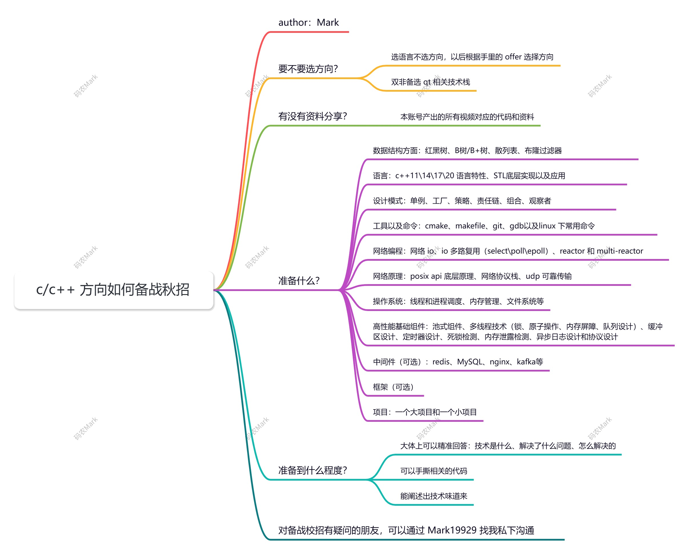

# 🌐 C++高并发HTTP服务器

**开源项目作者** | 2025.8 - 2025.9

## 项目描述

基于现代C++17构建的多线程HTTP服务器，采用RAII资源管理、生产者-消费者模式和智能指针等特性，实现从Socket通信到HTTP协议解析的全栈式框架。

## 功能实现

**线程池系统**

自主构建基于C++17标准的线程池系统，利用 `std::thread`、`mutex`、`condition_variable` 构建生产者-消费者模型。通过模板元编程实现万能引用和完美转发，支持任意可调用对象任务提交，结合 `std::apply` 实现变参模板参数解包，提升代码复用性和类型安全。

**RAII资源管理**

全面采用RAII原则管理Socket和文件描述符等系统资源，构造函数获取资源、析构函数自动释放，杜绝资源泄漏。集成C++异常处理机制，使用 `std::system_error` 封装系统调用错误，确保异常情况下的优雅降级。

**连接处理模型**

实现基于线程池的连接处理模型，虽能提升基础并发性能，但受限于阻塞I/O架构，不适合海量并发场景。通过固定大小线程池复用线程资源，避免频繁创建销毁开销。采用 `select()` 系统调用实现主循环超时控制，支持优雅关闭。自主实现HTTP/1.1协议解析器，支持静态文件服务。

## 技术栈

`C++17` `多线程` `RAII` `HTTP/1.1` `Socket` `select()` `生产者-消费者模式` `模板元编程`

---

🔗 [返回作品集](../index.md)
