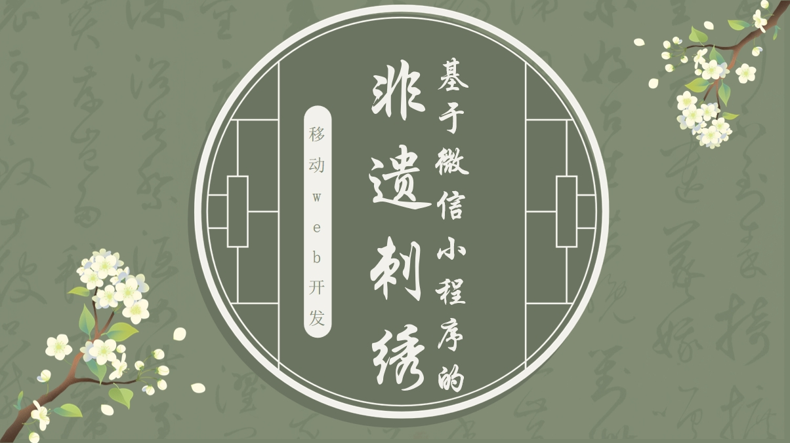
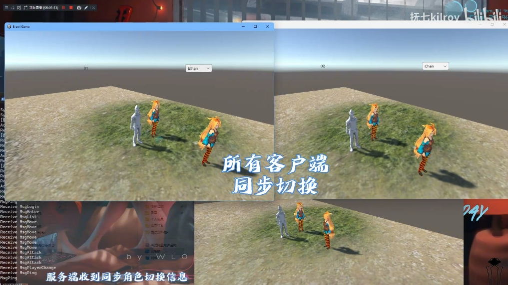
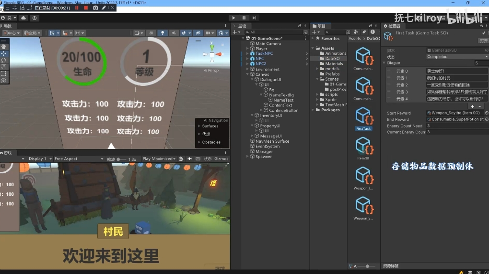

欢迎来到我的作品集！以下是我在不同领域的项目成果，点击分类标签切换查看。



<!-- tab 💻 编程作品 -->

### ⚡ Reactor模式C++ HTTP服务器

独立设计 | 2026.1 - 2026.3

一款高并发Web服务器，采用多线程Reactor + Epoll事件驱动架构，解决传统阻塞式服务器在高并发场景下的性能瓶颈。
基于主从Reactor模式，主线程负责监听新连接，工作线程通过Epoll实现IO多路复用；
使用有限状态机高效解析HTTP报文，支持分块接收与超大请求处理；
采用RAII思想封装Socket、Channel、Connection等资源；
实现O(1)时间复杂度的定时器轮盘进行非活跃连接检测；
自研环形缓冲区（Buffer），支持动态扩容与零拷贝数据移动。

**技术栈：** `C++11` `Linux` `Epoll` `Reactor` `线程池` `状态机` `RAII` `HTTP/1.1`

  <a href="/HEXO/portfolio/programming/reactor-http-server/" style="display: inline-block; padding: 8px 24px; background: #42b983; color: #fff; border-radius: 20px; text-decoration: none; font-size: 14px; font-weight: 500; transition: background 0.3s;">查看详情 →</a>

---

### 🚄 智能交通票务系统

全栈开发者 | 2025.10 - 2025.12

基于SpringBoot框架融合大模型技术的智能交通票务系统，集成DeepSeek、阿里万相等多模态生成式AI能力。
通过LangChain进行多轮对话交互和RAG检索增强，支持自然语言完成车票查询、预订、退改等全流程操作。
针对高并发场景使用乐观锁机制防止车票超售，通过"工具调用"机制将用户意图精准映射至后端票务接口，并搭建了完整的文生图流水线。

**技术栈：** `SpringBoot` `大语言模型` `LangChain` `RAG` `多模态生成式AI`

  <a href="/HEXO/portfolio/programming/Ai-ticket/" style="display: inline-block; padding: 8px 24px; background: #42b983; color: #fff; border-radius: 20px; text-decoration: none; font-size: 14px; font-weight: 500; transition: background 0.3s;">查看详情 →</a>

---

<!--
### 🌐 C++高并发HTTP服务器

开源项目作者 | 2025.8 - 2025.9

基于现代C++17构建的多线程HTTP服务器，采用RAII资源管理、生产者-消费者模式和智能指针等特性，实现从Socket通信到HTTP协议解析的全栈式框架。自主构建基于C++17标准的线程池系统，通过模板元编程实现万能引用和完美转发，支持任意可调用对象任务提交；全面采用RAII原则管理Socket和文件描述符等系统资源，杜绝资源泄漏；自主实现HTTP/1.1协议解析器，支持静态文件服务。

**技术栈：** `C++17` `多线程` `RAII` `HTTP/1.1` `Socket` `select()` `模板元编程`

  <a href="/HEXO/portfolio/programming/httpserver/" style="display: inline-block; padding: 8px 24px; background: #42b983; color: #fff; border-radius: 20px; text-decoration: none; font-size: 14px; font-weight: 500; transition: background 0.3s;">查看详情 →</a>

---
-->

### 🧵 非遗刺绣科普微信小程序

全栈开发者 | 2024.4 - 2024.6

一款基于微信小程序和云开发构建的非遗文化科普平台，集成文化传播、视频宣传、趣味游戏、商城购物等全功能模块。
深度集成微信云开发作为BaaS，实现前后端无缝对接；
设计并实现视频瀑布流与弹幕系统，增强用户互动；
开发拼图游戏与猜数字游戏，在游戏胜利时触发刺绣文化知识弹窗，实现"寓教于乐"；
基于云数据库实现商品列表分页加载与懒加载；建立深红主色+淡黄辅色的传统视觉体系。

**技术栈：** `微信小程序` `JavaScript` `微信云开发` `云数据库` `WeUI`

  <a href="/HEXO/portfolio/programming/embroidery/" style="display: inline-block; padding: 8px 24px; background: #42b983; color: #fff; border-radius: 20px; text-decoration: none; font-size: 14px; font-weight: 500; transition: background 0.3s;">查看详情 →</a>

<!-- endtab -->

<!-- tab 🎮 游戏作品 -->

### ⚔️ BrawlGame - 多人联机网络框架

游戏网络模块开发 | 2025.9 - 2025.10

基于C#和认Unity的高性能TCP网络通信框架，从底层协议编解码、异步非阻塞IO到上层事件驱动分发，完整支撑用户证、角色管理、实时位置/攻击同步等多人游戏业务逻辑。
设计了`[包长度(2字节)] + [协议名(变长)] + [JSON体(变长)]`的自定义协议，彻底解决TCP粘包问题；
基于async/await和SocketAsync API实现异步非阻塞网络核心；采用状态同步思想实现多端平滑同步；内置心跳保活机制处理网络异常。

**技术栈：** `Unity` `C#` `TCP/IP` `异步IO` `自定义协议` `观察者模式`

  <a href="/HEXO/portfolio/game/BrawlGame/" style="display: inline-block; padding: 8px 24px; background: #42b983; color: #fff; border-radius: 20px; text-decoration: none; font-size: 14px; font-weight: 500; transition: background 0.3s;">查看详情 →</a>

---

### 🎮 SimpleRPG - Unity RPG核心系统

Unity游戏开发 | 2025.8 - 2025.9

基于Unity引擎的RPG游戏核心系统，采用数据驱动与事件驱动的混合架构，完整覆盖玩家移动、物品拾取、武器装备、任务系统、敌人AI、背包UI等RPG核心玩法链路。
基于NavMeshAgent实现鼠标点击移动，通过射线检测区分地面与可交互对象；
构建可扩展的交互与任务系统，基于GameTaskSO任务状态机管理任务进度；
设计Weapon基类及近战/远程派生类；
敌人具备战斗/移动/休息三种状态，支持随机寻路与计时器驱动切换。

**技术栈：** `Unity` `C#` `NavMeshAgent` `ScriptableObject` `事件中心` `单例模式`

  <a href="/HEXO/portfolio/game/SimpleRPG/" style="display: inline-block; padding: 8px 24px; background: #42b983; color: #fff; border-radius: 20px; text-decoration: none; font-size: 14px; font-weight: 500; transition: background 0.3s;">查看详情 →</a>

<!-- endtab -->

<!-- tab 🎨 美术作品 -->

<!-- endtab -->



---

### 📌 关于项目

以上项目均为个人独立或合作完成。点击每个卡片底部的「查看详情」可阅读完整项目介绍、技术实现细节和开发心得。

**版权声明：** 所有项目代码及内容均为原创，未经授权请勿转载或商用。

### 实习经历
1
2
3
